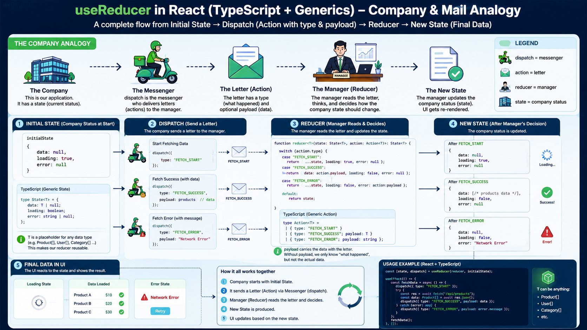

# React Learning Journey 🚀

This repository contains my exercises and projects while learning **React**. I've implemented core concepts to become a professional React developer.

---

Here You can see UseReducer Smaple with Code and Diagram and Examples better



## 📚 Concepts Implemented

### ✅ React Basics

- **Functional Components** – Modern component syntax
- **Class Components** – Traditional component syntax
- **JSX Syntax** – Writing HTML in JavaScript
- **Fragment** (`<>...</>`) – Render multiple elements without extra divs

### ✅ State Management

- **useState Hook** – State management in functional components
- **Local State** – Component-specific state (likes per user)
- **Lifting State Up** – Moving shared state to parent component (totalLikes in App)

### ✅ Props

- **Passing Props** – Sending data from parent to child
- **Children Prop** – Passing content between open/close tags
- **Spread Operator** (`{...user}`) – Auto-spreading props
- **Optional Props** – Using `?` for optional props
- **Default Values** – Fallback values for props

### ✅ TypeScript Integration

- **Type Definition** – Defining types for Props and State
- **Type Safety** – Type-safe functions (e.g., `(change: number): void`)

### ✅ Lists & Keys

- **map() Method** – Rendering lists with map
- **Key Prop** – Unique identification for list items to optimize rendering

### ✅ Event Handling

- **onClick Events** – Handling button clicks
- **Custom Functions** – Custom handlers like handleLike

### ✅ Conditional Rendering

- **&& Operator** – Conditional rendering (`{loading && <p>Loading...</p>}`)
- **Ternary Operator** – Dynamic styles and text based on state

### ✅ Async Operations

- **Async/Await** – Working with asynchronous operations
- **Promise** – Simulating server requests with setTimeout
- **Loading State** – Showing loading status to users

### ✅ Interaction Patterns

- **Like/Unlike System** – Toggle likes (like Instagram)
- **Two-way Data Flow** – Data flow through props and state
- **Re-render Mechanism** – Understanding React's re-rendering

---

## 🎯 Features

| Feature                  | Description                                                             |
| ------------------------ | ----------------------------------------------------------------------- |
| 👤 **User Display**      | List of users with full info (name, family, age, major, specialty)      |
| ❤️ **Like System**       | Each user can like/unlike (like Instagram)                              |
| 📊 **Total Likes**       | Shows total likes across all users                                      |
| 🔄 **Async User Loader** | Simulates loading user from server with 2-second delay                  |
| 🎨 **Inline Styles**     | Styling with inline style (flexbox, padding, border-radius)             |
| 👶 **Children Prop**     | Ability to pass extra content to component (Test button for first user) |

---

## 🔧 Installation & Running

```bash
# 1. Clone repository
git clone <your-repo-url>

# 2. Enter project folder
cd <project-folder>

# 3. Install dependencies
npm install

# 4. Run project
npm run dev
```

🧠 What I Learned
Class vs Functional Components – Why Functional with Hooks is better

How State & Props Work – State is internal, Props come from outside

Lifting State Up – Moving state to parent for shared access

Re-render in React – setState triggers component re-render

map and key – How to render lists and why key matters

TypeScript in React – Type-safe Props and State

Children Prop – How to receive and render content between tags

🚀 Next Steps
Learn useEffect for API calls

Learn useContext for global state

Learn useReducer for complex state

React Router for routing

Tailwind CSS for better styling
